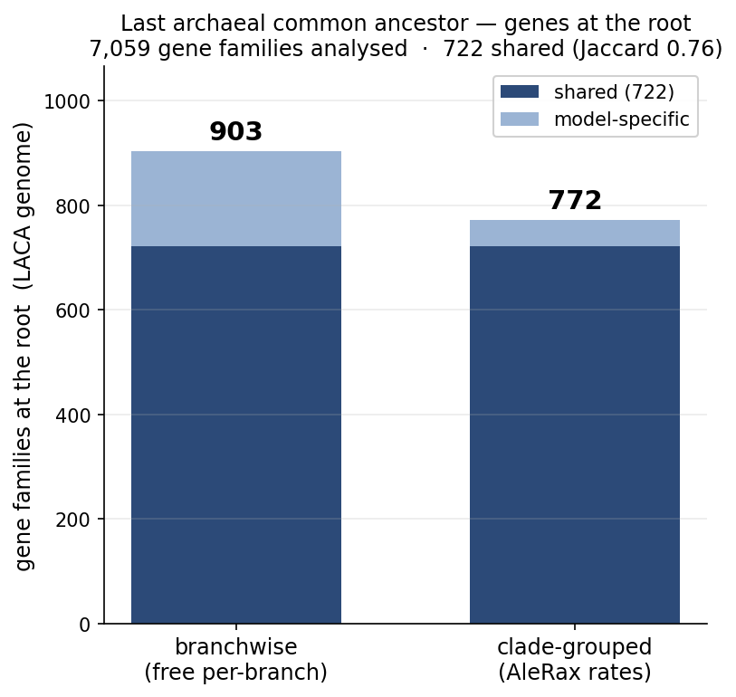
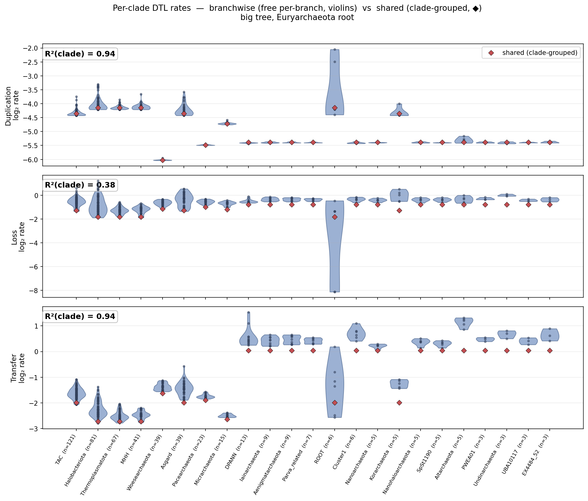

# Fully branch-wise DTL rates on the archaeal tree — preliminary

(Big tree = This_study / Undine C60, 257 taxa, 7,059 families; Euryarchaeota root.
Figures: [`rate_violin_bigtree_Eury.png`](rate_violin_bigtree_Eury.png),
[`laca_families_bigtree_Eury.png`](laca_families_bigtree_Eury.png) — embedded below.)

When we let the duplication, transfer and loss rates vary freely along every branch of
the species tree — rather than grouping branches into a handful of rate categories, as
AleRax does — the analysis still points to the same root, **Euryarchaeota**. It is clearly
the best-supported rooting, with the small-genome lineages that tend to draw the root
spuriously left strongly disfavoured.

The reconstructed ancestral genome agrees too. Of the **7,059 gene families** analysed, the
fully branch-wise model places **903 at the root** and AleRax's clade-grouped rates **772** —
the last archaeal common ancestor's gene complement — and these are largely the **same
families** (**722 shared**, Jaccard 0.76; per-family origination probabilities correlate
r ≈ 0.96), with the free model reconstructing a somewhat larger ancestral genome.

The rates themselves show a clear pattern. When they are free to vary, **duplication and
transfer come out essentially clade-constant** — the per-branch estimates barely depart from
a single rate per clade (R² ≈ 0.94) — whereas **loss rates vary substantially from branch to
branch even within a clade** (R² ≈ 0.38); that is, the data call for finer-grained variation
in loss than a clade-level model allows.

Two caveats. The detailed ordering of the *alternative* roots does not match AleRax — only
the top root is shared. And the fully branch-wise model is far more decisive: an AU test on it
supports Euryarchaeota *alone* and rejects MHH, whereas AleRax keeps an Euryarchaeota/MHH
region. That extra confidence reflects the much richer rate model — and the fact that the
optimisation had to be started near AleRax's solution — not stronger evidence. So we read this
as a **consistency/robustness check, not an independent recovery of the root**.

*In one line:* allowing fully branch-wise DTL rates recovers the same Euryarchaeota root, the
same ancestral gene content, and clade-structured duplication/transfer rates as AleRax — a
preliminary, reassuring consistency check.

## Figures

**Genes at the root (LACA):**

**Per-clade DTL rates — branchwise (free per-branch) vs shared (clade-grouped):**

